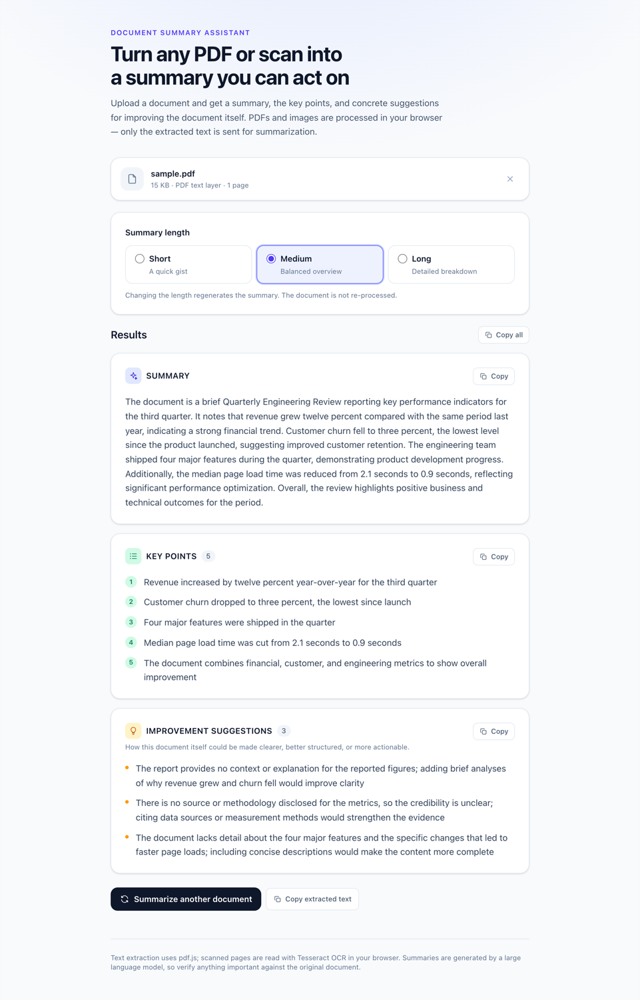

# Document Summary Assistant

Upload a PDF or a scanned image, and get an AI-generated summary, the document's key points, and concrete
suggestions for improving the document itself — at your choice of Short, Medium, or Long depth.

**Live demo → https://document-summary-assistant-murex.vercel.app**



*Real output: a text-based PDF summarized at Medium length by `openai/gpt-oss-120b` via Groq's free tier.*

---

## Features

| Requirement | How it works |
| --- | --- |
| **Upload PDFs and images** | File picker **and** drag-and-drop, with type, size, and empty-file validation. |
| **PDF text extraction** | `pdfjs-dist` in a Web Worker. Text runs are regrouped into lines and paragraphs by position, so reading order and paragraph breaks survive multi-column and oddly ordered PDFs. |
| **OCR for scanned documents** | `tesseract.js` in the browser. A PDF with no usable text layer is automatically re-rendered to images at 2× and pushed through the same OCR path. |
| **Smart summaries** | An OpenAI-compatible LLM behind a server-side API route, returning a strict JSON contract. |
| **Short / Medium / Long** | Each length has its own prompt spec (summary length, number of key points, number of suggestions). Changing length re-summarizes without re-extracting. |
| **Key points** | A validated list of specific, self-contained findings — not topic labels. |
| **Improvement suggestions** | Critique of *the document*: clarity, structure, completeness, evidence, and actionability, each naming a concrete weakness and its fix. |
| **Intuitive, responsive UI** | Single-column layout that works from 320 px up. Verified for no horizontal overflow at 390 px with full results on screen. |
| **Loading / progress states** | Real per-phase progress (per-page extraction, OCR model download, OCR per image, summarization) with a working Cancel. |
| **Error handling** | Distinct, actionable messages for unsupported, empty, oversized, corrupted, password-protected, and text-free files, plus provider auth, rate-limit, timeout, and malformed-output failures. |
| **Accessibility** | Keyboard-operable drop zone, radio-group length selector, labelled file input, `role="progressbar"` with a polite live region, visible focus rings, reduced-motion support. |

---

## Architecture

```
Browser                                     Server
┌───────────────────────────────┐          ┌──────────────────────────────┐
│ DropZone / FileCard           │          │ POST /api/summarize          │
│ LengthSelector / ProgressPanel│          │  ├─ zod-validate the request │
│ ResultView                    │          │  ├─ build a fenced prompt    │
│         │                     │  text    │  ├─ call the LLM provider    │
│ useDocumentSummary hook       │ ───────► │  ├─ parse + validate JSON    │
│         │                     │  only    │  └─ one repair retry         │
│ pdfjs-dist ──► text layer     │          │                              │
│ tesseract.js ──► OCR          │          │ LLM_API_KEY stays here       │
└───────────────────────────────┘          └──────────────────────────────┘
```

### Key decisions

**Extraction runs in the browser, not on the server.** Uploaded files never leave the user's machine — only the
extracted text is sent. This removes multipart upload handling, sidesteps serverless body-size and timeout limits,
and is a real privacy improvement. The trade-off is that OCR uses the client's CPU, so a scanned page takes
noticeably longer on a phone than on a laptop; the UI shows real progress throughout and can be cancelled.

**The server exists only to hold the API key.** It is a thin route over a shared, framework-agnostic core
(`shared/summarize.ts`). The Express route, the Vercel function, and the Netlify function are all ~10-line wrappers
around that same core, so every deployment target behaves identically and is covered by the same tests.

**Reading order is reconstructed, not assumed.** `pdfjs-dist` emits positioned text runs in content-stream order,
which is not always reading order, and it omits spaces between separately positioned runs. `src/lib/extract/layout.ts`
groups runs into lines by baseline, orders each line left-to-right, re-inserts missing spaces from horizontal gaps,
and converts large vertical gaps into paragraph breaks. It is pure and unit-tested.

**Document text is untrusted data, never instructions.** The extracted text is wrapped in sentinel delimiters that
are first stripped from the text itself, so a document cannot close the fence and escape into the instruction
context. The system prompt states explicitly that content inside the fence must never be obeyed.

**The AI response is a validated contract, not free text.** Generation is constrained at the provider with a JSON
Schema derived from the zod contract (`response_format: json_schema`, `strict: true`), so the two can never drift
apart. Endpoints that do not support `json_schema` are detected from their error and transparently downgraded to
`response_format: json_object`, once per endpoint. This matters most for small local models, which emit
valid-but-wrong-shaped JSON far more often than large hosted ones. The reply is brace-matched out
of any surrounding prose or code fence, normalized (snake_case keys, stray bullet prefixes, `[{point: "..."}]`
shapes, single strings in place of arrays), then validated with zod. A malformed reply triggers exactly one repair
retry; if that also fails the user gets an honest error rather than a broken result.

**No mock summaries, ever.** If `LLM_API_KEY` is unset the API returns HTTP 503 `not_configured` and the UI shows
setup instructions. There is no demo mode that fabricates output.

### Project layout

```
shared/      Framework-agnostic core, shared by browser and server
  contract.ts     zod schemas, summary-length specs, size limits
  prompt.ts       system prompt, fenced user prompt, injection defence
  llm.ts          OpenAI-compatible provider client
  parseResult.ts  tolerant JSON extraction + normalization
  summarize.ts    the request handler core
server/      Express 5 app; also serves the built SPA in production
api/         Vercel serverless wrapper
netlify/     Netlify Functions wrapper
src/
  components/     DropZone, FileCard, LengthSelector, ProgressPanel, ResultView, Alert, CopyButton
  hooks/          useDocumentSummary — the whole upload→extract→summarize state machine
  lib/extract/    pdf.ts, ocr.ts, layout.ts (pure), index.ts (routing + lazy loading)
  lib/            api.ts, fileValidation.ts, formatResult.ts
```

---

## Local setup

Requires **Node 20+**.

```bash
git clone <your-repo-url>
cd Document_Summary_Assignemnt
npm install

cp .env.example .env
# Open .env and set LLM_API_KEY to a real key (see below).

npm run dev
```

`npm run dev` starts Vite on <http://localhost:5173> and the API on <http://localhost:3001>, with `/api` proxied
from Vite to Express. Open **<http://localhost:5173>**.

To run the production build exactly as it is deployed:

```bash
npm run build
npm start          # serves the SPA and the API together on http://localhost:3001
```

### Environment variables

| Variable | Required | Default | Purpose |
| --- | --- | --- | --- |
| `LLM_API_KEY` | **Yes** | — | API key for an OpenAI-compatible provider. `OPENAI_API_KEY` is also accepted. |
| `LLM_BASE_URL` | No | `https://api.openai.com/v1` | Provider base URL, without `/chat/completions`. |
| `LLM_MODEL` | No | `gpt-4o-mini` | Model id. Must support JSON output. |
| `LLM_TIMEOUT_MS` | No | `90000` | Provider request timeout. |
| `PORT` | No | `3001` | Express port. |

**Getting a key.** Only `/v1/chat/completions` is used, so any OpenAI-compatible endpoint works. Free options
exist and need no code change — just these three variables:

```bash
# Groq — free tier, fast, and usable from a cloud deployment.
# Key: https://console.groq.com/keys
LLM_API_KEY=gsk_...
LLM_BASE_URL=https://api.groq.com/openai/v1
LLM_MODEL=openai/gpt-oss-120b

# Google Gemini — free tier. Key: https://aistudio.google.com/apikey
LLM_API_KEY=...
LLM_BASE_URL=https://generativelanguage.googleapis.com/v1beta/openai/
LLM_MODEL=gemini-2.0-flash

# OpenAI — paid. Key: https://platform.openai.com/api-keys
LLM_API_KEY=sk-...
LLM_MODEL=gpt-4o-mini

# Ollama — free and fully local, but LOCAL DEVELOPMENT ONLY (see below).
LLM_API_KEY=ollama
LLM_BASE_URL=http://localhost:11434/v1
LLM_MODEL=llama3.2
```

> **Ollama cannot be used by a deployed app.** `http://localhost:11434` resolves to whichever machine the server
> process is running on. On Vercel, Netlify, or Render that is their server, not your laptop, so the request fails.
> Use a hosted provider (free tiers above) for anything you deploy.

Free tiers are rate-limited — the app surfaces HTTP 429 as a clear "try again" message — and some providers may use
submitted prompts to improve their models, so avoid sending confidential documents through them.

The key is only ever read on the server. It is never bundled into the client and never sent to the browser.
`GET /api/health` reports `{ "llmConfigured": true | false }` without revealing the key.

---

## Commands

| Command | What it does |
| --- | --- |
| `npm run dev` | Vite dev server + Express API with hot reload |
| `npm run build` | Production build: SPA to `dist/public`, server to `dist/server` |
| `npm start` | Serve the built SPA and API from one Node process |
| `npm test` | Run the Vitest suite once |
| `npm run test:watch` | Vitest in watch mode |
| `npm run lint` | ESLint (type-aware) across app, server, and tests |
| `npm run typecheck` | `tsc --noEmit` over the browser and Node projects |

---

## Deployment

### Option A — one Node service (verified locally end to end)

Works on Render, Railway, Fly.io, or any Node host. One process serves both the SPA and the API, so there is no
CORS or routing configuration to get wrong.

1. Build command: `npm install && npm run build`
2. Start command: `npm start`
3. Environment variables: set `LLM_API_KEY` (plus `LLM_BASE_URL` / `LLM_MODEL` if not using OpenAI defaults).
   `PORT` is supplied by the host and is read automatically.

### Option B — Vercel (this is how the live demo is deployed)

`vercel.json` and `api/summarize.ts` are included. Vercel builds the SPA and deploys `api/summarize.ts` as a
serverless function. The function has been bundled with esbuild (the same bundler Vercel uses) and executed against
a live provider, returning a valid summary — so the import graph and handler contract are verified.

```bash
npm i -g vercel
vercel                                    # link the project
vercel env add LLM_API_KEY production     # paste the key when prompted
vercel --prod
```

Or via the dashboard: import the repository, then add `LLM_API_KEY` under **Settings → Environment Variables** and
redeploy. `vercel.json` already sets the build command, the `dist/public` output directory, a 60-second function
timeout, and the SPA rewrite.

### Option C — Netlify

`netlify.toml` and `netlify/functions/summarize.mts` are included.

```bash
npm i -g netlify-cli
netlify init
netlify env:set LLM_API_KEY "sk-..."
netlify deploy --prod
```

### After deploying

Environment variables are applied at build time, so after adding them you must **redeploy** — an existing
deployment will keep returning `503 not_configured` until you do.

1. Open the live URL in an incognito window.
2. Upload a real text-based PDF and confirm a summary appears.
3. Upload a real scanned image and confirm OCR runs (the first run downloads ~4 MB, so allow time).
4. Switch between Short, Medium, and Long and confirm the depth changes.
5. Check the browser console for errors.

---

## Known limitations

- **OCR downloads from a CDN.** `tesseract.js` fetches its WASM core and the English language model (~4 MB) from
  `cdn.jsdelivr.net` on first use. OCR therefore needs network access, and a strict `Content-Security-Policy` that
  blocks jsdelivr will break it. pdf.js's worker *is* bundled and served from your own origin.
- **English OCR only.** The Tesseract worker is created with the `eng` model.
- **Scanned-PDF OCR covers the first 5 pages**, and direct PDF text extraction covers the first 40. Both caps exist
  to keep the browser responsive; the extracted text says so explicitly when a document is truncated.
- **Document text is capped at 60,000 characters** before summarization, with a visible truncation notice.
- **OCR quality depends on the scan.** Blurry, low-contrast, rotated, or handwritten pages produce poor text. Mean
  Tesseract confidence below 65% raises a visible warning; there is no deskew or denoise preprocessing.
- **OCR is CPU-bound on the client** and is noticeably slower on phones than on laptops.
- **Complex PDF layouts** — dense tables, sidebars, and heavy multi-column pages — still degrade. The layout pass
  reconstructs lines and paragraphs from geometry, but it does not detect table or column structure.
- **Encrypted or image-only PDFs** with no renderable content cannot be read, and report that explicitly.
- **Summaries come from an LLM** and can be wrong. The UI says so; verify anything important against the source.
- **Model availability changes.** Groq's catalogue shifts over time; if `LLM_MODEL` 404s, list what your account can
  use with `curl https://api.groq.com/openai/v1/models -H "Authorization: Bearer $LLM_API_KEY"` and pick a chat model.
- **Free-tier rate limits apply** to the hosted demo. A burst of requests can return a "try again" message; the app
  surfaces that clearly rather than failing silently.

---

## Testing

84 tests across 11 files (`npm test`):

- `shared/parseResult.test.ts` — brace-matched JSON extraction from prose and code fences, escaped quotes, snake_case
  keys, bullet stripping, object-wrapped entries, and rejection of incomplete replies.
- `shared/prompt.test.ts` — fence sanitization against prompt injection, and length-to-depth mapping.
- `shared/jsonSchema.test.ts` — strict-mode schema sanitization, and a guard that the JSON Schema stays derived from
  the zod contract.
- `shared/summarize.test.ts` — the handler against a stubbed provider: happy path, validation failures, missing key,
  malformed-output retry, auth failure, rate limiting, unreachable provider, custom base URL, json_schema
  enforcement, and the one-time downgrade for endpoints that reject it.
- `server/app.test.ts` — the Express routes via supertest, including malformed JSON and JSON 404s.
- `src/lib/extract/layout.test.ts` — reading-order reconstruction, missing-space insertion, paragraph gaps, superscripts.
- `src/lib/fileValidation.test.ts`, `src/lib/formatResult.test.ts` — pure helpers, including the empty-MIME-type
  fallback Safari needs.
- `src/components/*.test.tsx` — drop-zone drag/drop/picker/disabled behaviour and the length radio group.
- `src/App.test.tsx` — the full pipeline: upload → extract → summarize → render, length switching without
  re-extraction, unsupported files, extraction failure hints, the missing-key path (asserting *no* summary is shown),
  low-confidence warnings, reset, and progress/cancel.

---

## Licence

MIT — see [LICENSE](LICENSE).
